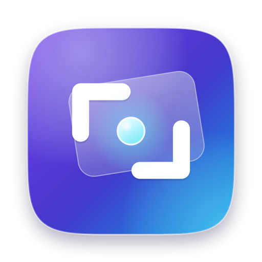
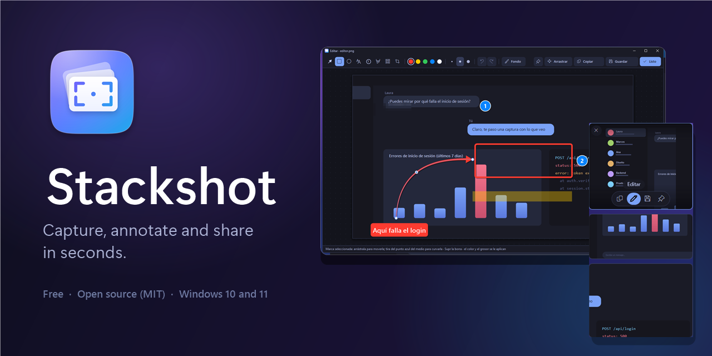

<div align="center">



# Stackshot

**Beautiful screenshots for Windows.**<br>
The CleanShot X experience, finally on Windows: floating thumbnails, a lightning-fast editor, video and GIF. Free and open source.

[](https://github.com/rubenitx/stackshot/releases/latest/download/Stackshot.exe)

[](LICENSE)


[Español](README.md) · [Download](https://github.com/rubenitx/stackshot/releases/latest) · [Changelog](CHANGELOG.md)



</div>

Press **Print Screen**, pick an area (or click a window) and the screenshot floats in a corner, ready to **drag** into a chat, **paste** anywhere or **annotate** in a second. Whatever you don't save cleans itself up — no more desktop full of "Screenshot (37).png".

Inspired by CleanShot X, built for Windows: a single `.exe` under 1 MB, nothing else to install.

> The app's interface is in Spanish for now. English UI is on the roadmap — contributions welcome!

## Features

- **Floating stack** in the bottom-left corner: drag to any app, paste with Ctrl+V (the thumbnail retires itself), swipe left to dismiss, scroll with the mouse wheel when there are many (up to 20). Follows your mouse across monitors. Hidden from screen sharing and from your own screenshots.
- **Pixel-perfect selection**: the screen freezes; drag an area with a magnifier and live size, or click a window to capture it (with transparent Windows 11 rounded corners).
- **Quick editor**: curved tapered arrows, rectangles, ellipses, numbered steps, text, highlighter, pixelate, non-destructive crop; move, resize or delete any mark afterwards. Enter copies and closes.
- **Video (MP4) and GIF** of any area, with the cursor, crisp at any Windows scaling. FFmpeg is downloaded once from GitHub (SHA-256 verified) the first time you record.
- **Per-user install, no admin rights**: welcome window to choose start-with-Windows and where to keep your saved screenshots; shows up in Settings > Apps for uninstalling. Silent install for IT: `Stackshot.exe --install --startup`.
- **Private and light**: no accounts, no cloud, no telemetry. ~40 MB of RAM and 0% CPU when idle.

## Shortcuts

| Shortcut | Action |
|---|---|
| **Print Screen** | Capture an area (or click a window / the desktop) |
| **Ctrl + Print Screen** | Capture the screen under the mouse |
| **Alt + Print Screen** | Capture the active window |
| **Shift + Print Screen** | Record video (press again to stop) |
| **Ctrl + Shift + Print Screen** | Record a GIF |

> **"Windows protected your PC"**: Stackshot isn't code-signed yet, so SmartScreen warns the first time. Click **More info > Run anyway**. Every release is built by GitHub Actions from this source.

## Build from source

No Visual Studio needed — Windows ships the C# compiler:

```powershell
git clone https://github.com/rubenitx/stackshot
cd stackshot
.\build.ps1        # bin\Stackshot.exe
.\build.ps1 -Run   # build and run without installing
```

## License

[MIT](LICENSE) © 2026 Rubén Martínez. FFmpeg is not bundled; it is downloaded separately under its own license (GPL) only if you record video or GIF.
