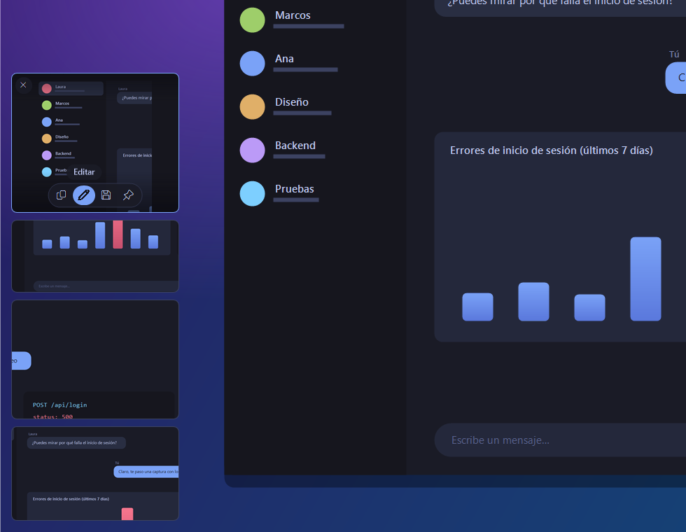
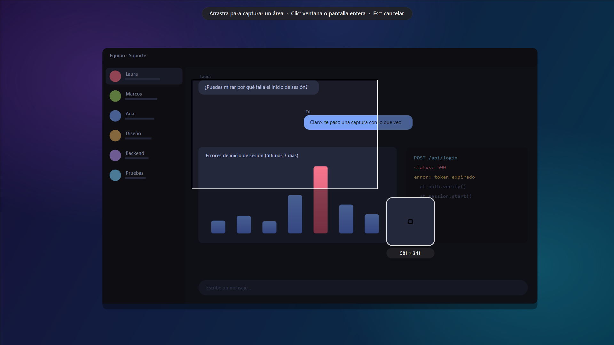
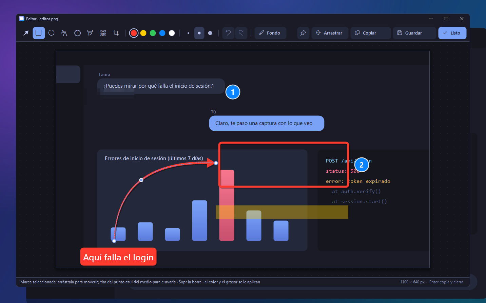
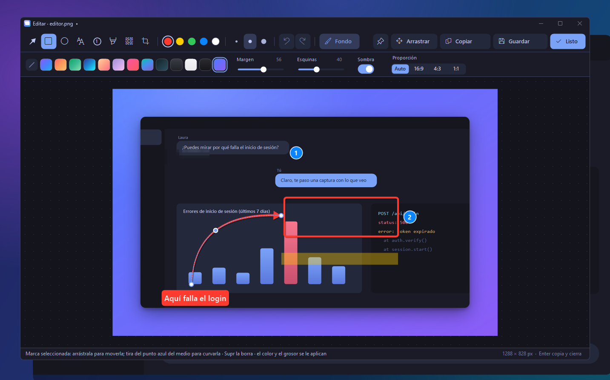
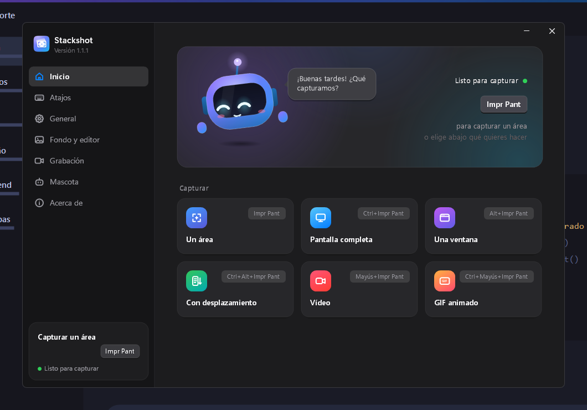
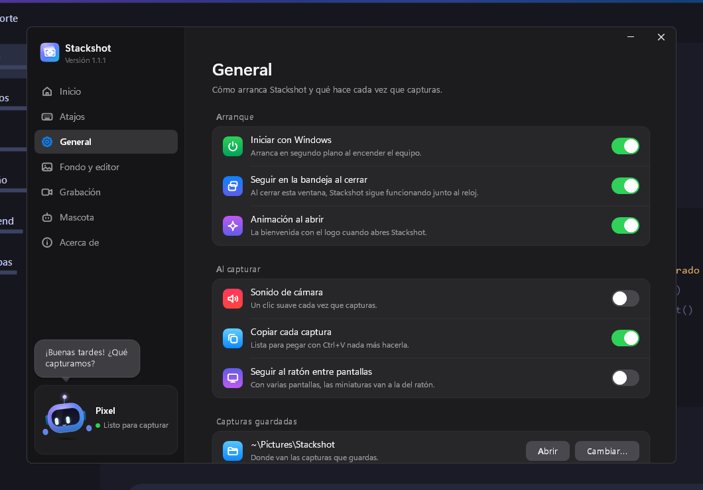

<div align="center">


**Captura, marca y comparte en segundos.**<br>
Herramienta de capturas de pantalla para Windows con miniaturas flotantes, editor rápido, captura con desplazamiento, vídeo y GIF.

[](https://github.com/rubenitx/stackshot/releases/latest)
[](https://github.com/rubenitx/stackshot/releases)
[](https://github.com/rubenitx/stackshot/actions/workflows/build.yml)
[](LICENSE)

[Descargar](https://github.com/rubenitx/stackshot/releases/latest/download/Stackshot.exe) · [Novedades](CHANGELOG.md) · [Seguridad](SECURITY.md) · [English](README.md)

</div>

---

Pulsa <kbd>Impr Pant</kbd>, selecciona un área y la captura se queda en una esquina de la pantalla, lista para arrastrarla a un chat, pegarla con <kbd>Ctrl</kbd>+<kbd>V</kbd> o marcarla. Las capturas que no guardas se borran solas al cabo de una hora.

Stackshot lleva a Windows la forma de trabajar de CleanShot X. Es un único ejecutable de unos 0,5 MB, se instala por usuario sin permisos de administrador y no depende de ningún otro programa.

<div align="center">

</div>

## Funciones

- **Pila flotante.** Cada captura aparece como miniatura abajo a la izquierda. Se puede arrastrar a cualquier aplicación, pegar, descartar deslizándola o recorrer con la rueda del ratón (hasta 20). Sigue al ratón entre pantallas y no aparece al compartir pantalla.
- **Selección precisa.** La pantalla se congela al instante. Se arrastra un área con lupa y medidas, o se hace clic en una ventana para capturarla entera, con las esquinas redondeadas de Windows 11.
- **Captura con desplazamiento.** Se selecciona un área y se desplaza el contenido, a mano o de forma automática; los fotogramas se unen en una sola imagen sin repetir cabeceras ni pies fijos.
- **Editor.** Flechas que se pueden curvar, recuadros, elipses, números, texto, resaltado, pixelado y recorte no destructivo. Cualquier marca se puede mover, cambiar de tamaño o borrar después.
- **Fondo de presentación.** La captura se coloca sobre un degradado o sobre el fondo de escritorio desenfocado, con margen, esquinas redondeadas, sombra y proporción fija. Las mismas opciones sirven para las grabaciones.
- **Vídeo y GIF.** Graba un área de la pantalla en MP4 o GIF, con el cursor.
- **Fijar en pantalla.** Mantiene una captura por encima de todas las ventanas, con zoom y transparencia.
- **Ventana principal.** Todas las acciones, atajos y ajustes en un sitio, con Pixel, una pequeña mascota animada a la que se puede cambiar el nombre y el color, o esconder. Al cerrar la ventana, Stackshot sigue en la bandeja.

<table>
  <tr>
    <td width="50%"></td>
    <td width="50%"></td>
  </tr>
  <tr>
    <td></td>
    <td></td>
  </tr>
  <tr>
    <td></td>
    <td></td>
  </tr>
</table>

## Instalación

1. Descarga **[Stackshot.exe](https://github.com/rubenitx/stackshot/releases/latest/download/Stackshot.exe)** y ábrelo.
2. Elige si debe arrancar con Windows y dónde guardar las capturas.
3. Pulsa **Instalar y empezar** y después <kbd>Impr Pant</kbd>.

Se instala en `%LOCALAPPDATA%\Programs\Stackshot`, añade un acceso al menú Inicio y aparece en **Configuración > Aplicaciones** para desinstalarlo. Funciona en Windows 10 y 11 con el .NET Framework 4.8 que ya trae Windows. Para actualizar, basta con abrir un `Stackshot.exe` más reciente.

Como el ejecutable todavía no está firmado digitalmente, SmartScreen muestra un aviso la primera vez (**Más información > Ejecutar de todas formas**). Cada versión se puede verificar como se explica en [SECURITY.md](SECURITY.md).

<details>
<summary>Instalación silenciosa</summary>

```powershell
Stackshot.exe --install --startup --folder "D:\Capturas"   # --no-start para no abrirlo al terminar
Stackshot.exe --uninstall --quiet
```
</details>

## Atajos

| Atajo | Acción |
|---|---|
| <kbd>Impr Pant</kbd> | Capturar un área, una ventana o la pantalla entera |
| <kbd>Ctrl</kbd>+<kbd>Impr Pant</kbd> | Capturar la pantalla en la que está el ratón |
| <kbd>Alt</kbd>+<kbd>Impr Pant</kbd> | Capturar la ventana activa |
| <kbd>Ctrl</kbd>+<kbd>Alt</kbd>+<kbd>Impr Pant</kbd> | Captura con desplazamiento (otra vez para terminar) |
| <kbd>Mayús</kbd>+<kbd>Impr Pant</kbd> | Grabar vídeo (otra vez para parar) |
| <kbd>Ctrl</kbd>+<kbd>Mayús</kbd>+<kbd>Impr Pant</kbd> | Grabar GIF |

Todos se pueden cambiar en la sección **Atajos** de la ventana principal. Si Windows 11 reserva <kbd>Impr Pant</kbd> para Recortes, Stackshot se ofrece a liberarla para el usuario actual.

<details>
<summary>Atajos del editor</summary>

| Tecla | Acción |
|---|---|
| <kbd>F</kbd> <kbd>R</kbd> <kbd>E</kbd> <kbd>T</kbd> <kbd>N</kbd> <kbd>H</kbd> <kbd>P</kbd> <kbd>C</kbd> | Flecha, recuadro, elipse, texto, números, resaltar, pixelar, recortar |
| <kbd>B</kbd> | Fondo de presentación |
| <kbd>1</kbd>–<kbd>5</kbd>, <kbd>−</kbd> <kbd>+</kbd> | Color, grosor |
| <kbd>Ctrl</kbd>+<kbd>Z</kbd>, <kbd>Ctrl</kbd>+<kbd>Y</kbd> | Deshacer, rehacer |
| <kbd>Ctrl</kbd>+<kbd>C</kbd>, <kbd>Ctrl</kbd>+<kbd>S</kbd> | Copiar, guardar |
| <kbd>Enter</kbd> | Aplicar, copiar y cerrar |
| <kbd>Supr</kbd>, flechas | Borrar o mover la marca seleccionada |
</details>

## Privacidad y seguridad

- Sin cuentas, sin servicios en la nube y sin telemetría. Las capturas no salen del equipo.
- La única conexión es la descarga, una sola vez, de FFmpeg 9.0.2 al grabar por primera vez. El paquete se comprueba con una suma SHA-256 guardada en el código y se descarta si no coincide.
- Las capturas temporales se guardan en `%LOCALAPPDATA%\Stackshot\temp` y se borran al cabo de una hora, nunca mientras sigan en pantalla.
- Cada versión la compila GitHub Actions a partir de este repositorio y se publica con su suma SHA-256 y una atestación de procedencia firmada.

Los detalles y cómo informar de una vulnerabilidad están en [SECURITY.md](SECURITY.md).

## Rendimiento

| | |
|---|---|
| En reposo | Unos 40 MB de RAM y sin uso de CPU |
| Selección de área | Menos de 1 ms por movimiento del ratón; solo se redibuja lo que cambia |
| Tras capturar | La miniatura aparece al momento; el PNG se escribe en segundo plano |
| Ejecutable | Unos 0,5 MB, sin nada más que instalar |

## Compilar desde el código

No hace falta Visual Studio: basta el compilador de C# que incluye Windows.

```powershell
git clone https://github.com/rubenitx/stackshot
cd stackshot
.\build.ps1          # genera bin\Stackshot.exe
.\build.ps1 -Run     # compila y lo abre sin instalar
```

| Carpeta | Contenido |
|---|---|
| `src/` | La aplicación (C# 5, WinForms): captura, miniaturas, editor, grabación, ventana principal e instalación |
| `assets/` | Logo e icono, dibujados en código por `tools\make-logo.ps1` |
| `docs/` | Imágenes del README, regeneradas sobre un escritorio sintético por `tools\make-screenshots.ps1` |

## Contribuir

Los fallos y las sugerencias son bienvenidos en [Issues](https://github.com/rubenitx/stackshot/issues). El código está comentado en castellano; cómo compilar, las reglas del código y el mapa de ficheros están en [CONTRIBUTING.md](CONTRIBUTING.md). Los problemas de seguridad se comunican de forma privada, como se indica en [SECURITY.md](SECURITY.md).

## Licencia

[MIT](LICENSE) © 2026 Rubén Martínez.

FFmpeg no se incluye. Se descarga aparte, con su propia licencia (GPL), solo al grabar vídeo o GIF.
