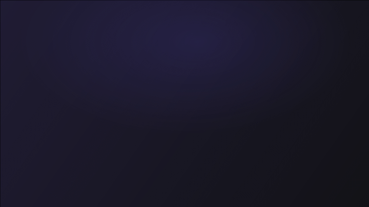
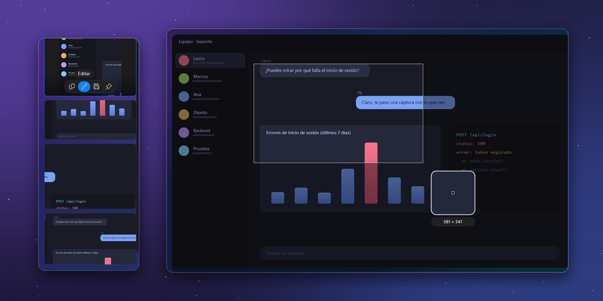
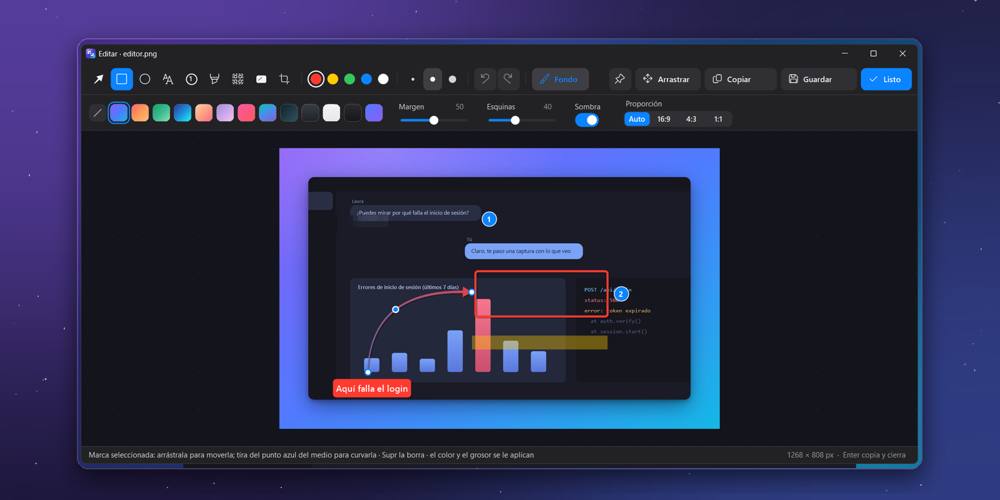
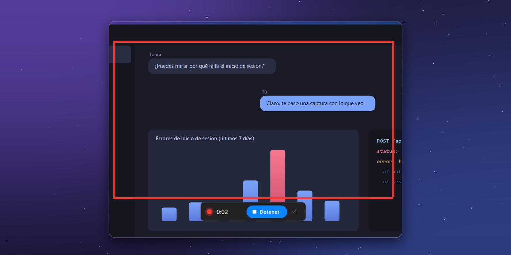
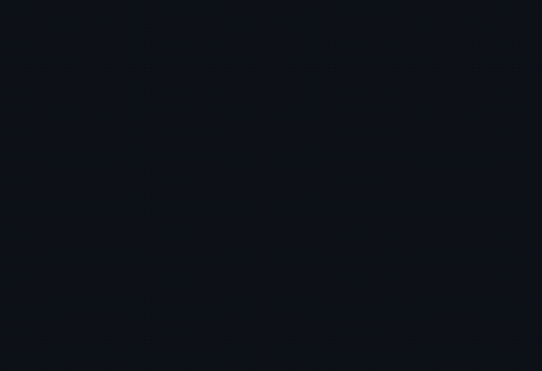
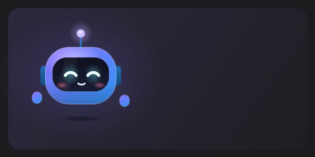
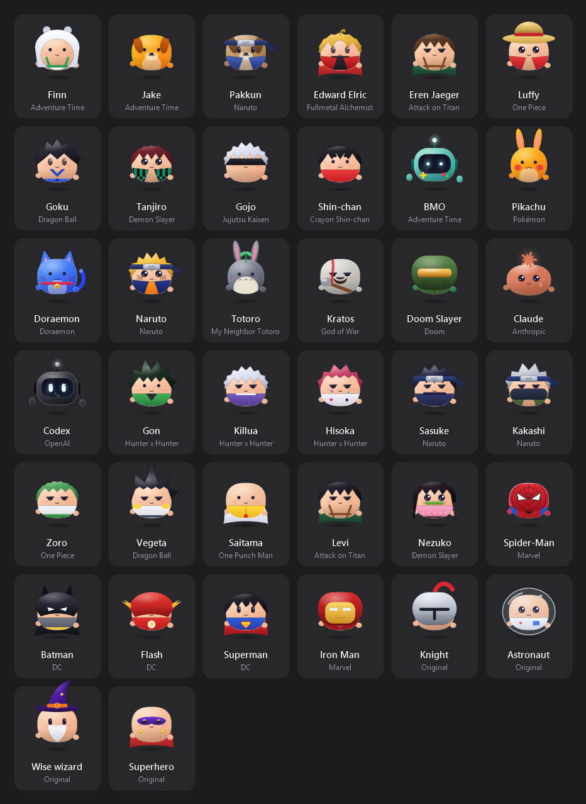
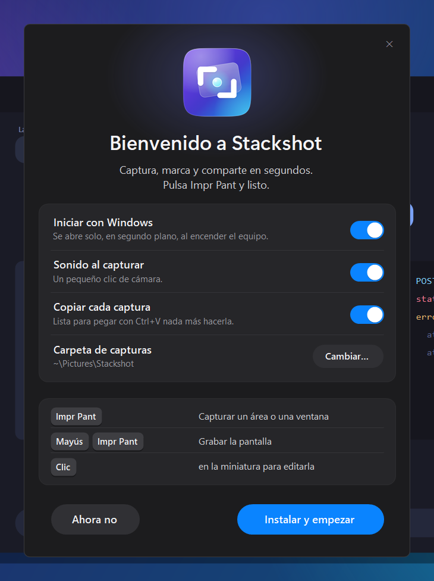

<div align="center">



**Capture, annotate and share in seconds.**<br>
A screenshot tool for Windows with floating thumbnails, a quick editor, scrolling capture, video and GIF.

[](https://github.com/rubenitx/stackshot/releases/latest)
[](https://github.com/rubenitx/stackshot/releases)
[](https://github.com/rubenitx/stackshot/actions/workflows/build.yml)
[](LICENSE)

[Download](https://github.com/rubenitx/stackshot/releases/latest/download/Stackshot.exe) · [Changelog](CHANGELOG.md) · [Security](SECURITY.md) · [Español](README.es.md)

</div>

---

Press <kbd>Print Screen</kbd>, select an area and the screenshot stays in the corner of the screen, ready to be dragged into a chat, pasted with <kbd>Ctrl</kbd>+<kbd>V</kbd> or annotated. Screenshots you don't keep are deleted automatically after an hour.

Stackshot brings the CleanShot X workflow to Windows. It ships as a single executable of about 0.7 MB, installs per user without administrator rights and doesn't depend on any other program.

<div align="center">

</div>

> [!NOTE]
> The user interface is currently in Spanish. An English translation is planned and contributions are welcome.

## Features

### Capture



- **Floating stack.** Each screenshot appears as a thumbnail in the bottom-left corner. Drag it into any application, paste it, swipe it away, or scroll through up to 20 of them. It follows the mouse across monitors and is excluded from screen sharing.
- **Precise selection.** The screen freezes instantly. Drag an area with a magnifier and live dimensions, or click a window to capture it, including the rounded corners of Windows 11.
- **Scrolling capture.** Select an area and scroll, or let Stackshot scroll for you; the frames are stitched into a single image without repeating sticky headers or footers.
- **Pin to screen.** Keep a screenshot floating above every window, with zoom and opacity.

### Edit



- **Editor.** Arrows that can be curved, rectangles, ellipses, numbered steps, text, highlighter, pixelation, solid redaction and non-destructive cropping. Every mark can be moved, resized or deleted afterwards.
- **Presentation backdrop.** Place a screenshot on a gradient, on your blurred wallpaper or on an image of your own, with padding, rounded corners, shadow and a fixed aspect ratio. The same options apply to recordings.

### Record



Record an area of the screen as MP4 or GIF, including the cursor, in standard, high or maximum quality and, optionally, with your webcam in a round or square bubble. Then trim the start and end, change the speed (1.5× or 2×), the size or the format, and export.

### Main window

Every action, shortcut and setting in one place, with quick profiles (Performance, Balanced, Complete). Closing the window keeps Stackshot running in the tray; double-click the tray icon to bring it back.

<div align="center">

</div>

### A mascot of your own

Twelve species, 23 colors, eye styles, dozens of hats, outfits and accessories, three personalities and friendship levels that unlock extras. Optionally it lives on the desktop: it walks above the taskbar, hops onto the window in front of you and rides along when you move it, naps when you are away, waves goodbye and walks off when you send it home, and is never captured.

The **Personajes** (Characters) section dresses it up as fan tributes to characters from anime, series, comics and games, plus a few originals: 38 in total. One click and it becomes Goku, Spider-Man or Kratos; hovering a costume shows where it comes from.

<div align="center">

</div>

<details>
<summary>All 38 character costumes</summary>
<br>
<div align="center">

</div>
</details>

## Installation



1. Download **[Stackshot.exe](https://github.com/rubenitx/stackshot/releases/latest/download/Stackshot.exe)** and run it.
2. Choose whether it starts with Windows and where saved screenshots go.
3. Click **Instalar y empezar** (Install and start), then press <kbd>Print Screen</kbd>.

Stackshot installs to `%LOCALAPPDATA%\Programs\Stackshot`, adds a Start menu entry and appears in **Settings > Apps** for uninstalling. It runs on Windows 10 and 11 with the .NET Framework 4.8 that ships with Windows. To update, use the in-app update or run a newer `Stackshot.exe`.

Because the executable is not code-signed yet, SmartScreen shows a warning the first time it runs (**More info > Run anyway**). On computers managed by an organization, SmartScreen may be configured to block it outright; in that case, ask your IT department to deploy the MSI package described below. Each release can be verified as described in [SECURITY.md](SECURITY.md).

<details>
<summary><b>Deploying in an organization</b> (MSI for Intune, Configuration Manager and similar tools)</summary>
<br>

Every release also includes **[Stackshot.msi](https://github.com/rubenitx/stackshot/releases/latest/download/Stackshot.msi)**, a Windows Installer package that installs per user, in the user's context, without administrator rights.

| | |
|---|---|
| Install | `msiexec /i Stackshot.msi /qn` |
| Uninstall | `msiexec /x Stackshot.msi /qn` (or from **Settings > Apps**) |
| Options | `STARTWITHWINDOWS=0` to skip starting with Windows, `LAUNCHAPP=0` to skip opening it after installation |
| Detection | Product code from the package, or `%LOCALAPPDATA%\Programs\Stackshot\Stackshot.exe` with version ≥ the deployed one |
| Intune | Win32 app, install behaviour **User**, no restart required |

When the MSI manages the installation, upgrades and removal go through Windows Installer: a newer `Stackshot.msi` replaces the previous version and keeps the user's settings. Stackshot is closed and reopened automatically, so no restart is needed. Uninstalling removes the application and its data, but not the screenshots the user saved. An existing installation made with `Stackshot.exe` is adopted without leaving duplicate entries.
</details>

<details>
<summary><b>Silent installation with the executable</b></summary>

```powershell
Stackshot.exe --install --startup --folder "D:\Screenshots"   # add --no-start to skip launching it
Stackshot.exe --uninstall --quiet
```
</details>

## Keyboard shortcuts

| Shortcut | Action |
|---|---|
| <kbd>Print Screen</kbd> | Capture an area, a window or the whole screen |
| <kbd>Ctrl</kbd>+<kbd>Print Screen</kbd> | Capture the screen under the mouse |
| <kbd>Alt</kbd>+<kbd>Print Screen</kbd> | Capture the active window |
| <kbd>Ctrl</kbd>+<kbd>Alt</kbd>+<kbd>Print Screen</kbd> | Scrolling capture (press again to finish) |
| <kbd>Shift</kbd>+<kbd>Print Screen</kbd> | Record video (press again to stop) |
| <kbd>Ctrl</kbd>+<kbd>Shift</kbd>+<kbd>Print Screen</kbd> | Record a GIF |

All shortcuts can be changed in the **Atajos** (Shortcuts) section of the main window. If Windows 11 reserves <kbd>Print Screen</kbd> for the Snipping Tool, Stackshot offers to release it for the current user.

<details>
<summary>Editor shortcuts</summary>

| Key | Action |
|---|---|
| <kbd>F</kbd> <kbd>R</kbd> <kbd>E</kbd> <kbd>T</kbd> <kbd>N</kbd> <kbd>H</kbd> <kbd>P</kbd> <kbd>X</kbd> <kbd>C</kbd> | Arrow, rectangle, ellipse, text, numbers, highlight, pixelate, redact, crop |
| <kbd>B</kbd> | Presentation backdrop |
| <kbd>1</kbd>–<kbd>5</kbd>, <kbd>−</kbd> <kbd>+</kbd> | Colour, stroke width |
| <kbd>Ctrl</kbd>+<kbd>Z</kbd>, <kbd>Ctrl</kbd>+<kbd>Y</kbd> | Undo, redo |
| <kbd>Ctrl</kbd>+<kbd>C</kbd>, <kbd>Ctrl</kbd>+<kbd>S</kbd> | Copy, save |
| <kbd>Enter</kbd> | Apply, copy and close |
| <kbd>Delete</kbd>, arrow keys | Delete or move the selected mark |
</details>

## Privacy and security

- No accounts, cloud services or telemetry. Screenshots never leave the computer.
- Network access is limited to two things: a one-time download of FFmpeg 9.0.2 when recording for the first time (checked against a SHA-256 hash stored in the source code), and a daily update check against the GitHub Releases API, which sends nothing about you and can be turned off in General.
- Updates install from the app in one click, but only if they match the SHA-256 GitHub reports and carry a valid signature made with the maintainer's key, which is never stored in the repository; otherwise they are discarded. Unsigned releases are only offered as a download.
- Screenshots copied by Stackshot are never synced to other devices through the cloud clipboard.
- Temporary screenshots live in `%LOCALAPPDATA%\Stackshot\temp` and are removed after an hour, never while they are still on screen.
- Releases are built by GitHub Actions from this repository and published with a SHA-256 checksum and a signed build provenance attestation.

Details and the vulnerability reporting process are in [SECURITY.md](SECURITY.md).

## Performance

| | |
|---|---|
| Idle | About 40 MB of RAM and no CPU usage |
| Area selection | Under 1 ms per mouse movement; only the changed regions are redrawn |
| After a capture | The thumbnail appears immediately; the PNG is written in the background |
| Executable | About 0.7 MB, no runtime to install |

## Building from source

Visual Studio is not required; the C# compiler included with Windows is enough.

```powershell
git clone https://github.com/rubenitx/stackshot
cd stackshot
.\build.ps1          # produces bin\Stackshot.exe
.\build.ps1 -Run     # builds and runs it without installing
```

| Folder | Contents |
|---|---|
| `src/` | The application (C# 5, WinForms): capture, thumbnails, editor, recording, main window and installer |
| `assets/` | Logo and icon, drawn in code by `tools\make-logo.ps1` |
| `docs/` | README images: screenshots regenerated on a synthetic desktop by `tools\make-screenshots.ps1` and framed into the feature images by `tools\make-feature-cards.py`, and the mascot animation and character sheet by `tools\make-reel.ps1` |

## Contributing

Bug reports and suggestions are welcome in [Issues](https://github.com/rubenitx/stackshot/issues). Code comments are in English; build instructions, conventions and an overview of the source are in [CONTRIBUTING.md](CONTRIBUTING.md). Please report security issues privately as described in [SECURITY.md](SECURITY.md).

## License

[MIT](LICENSE) © 2026 Rubén Martínez.

FFmpeg is not bundled. It is downloaded separately, under its own license (GPL), only when recording video or GIF.

The mascot costumes under **Personajes** (Characters) are non-commercial fan tributes drawn from scratch in the mascot's own style. The characters and names (Finn, Jake, BMO, Pakkun, Naruto, Sasuke, Kakashi, Edward Elric, Eren Jaeger, Levi, Luffy, Zoro, Goku, Vegeta, Tanjiro, Nezuko, Gojo, Gon, Killua, Hisoka, Saitama, Shin-chan, Pikachu, Doraemon, Totoro, Kratos, Doom Slayer, Spider-Man, Iron Man, Batman, Superman, Flash, Claude, Codex) belong to their respective owners, and Stackshot is not affiliated with or endorsed by any of them. If you hold the rights to one of them and want it removed, open an issue and it will be taken out.
