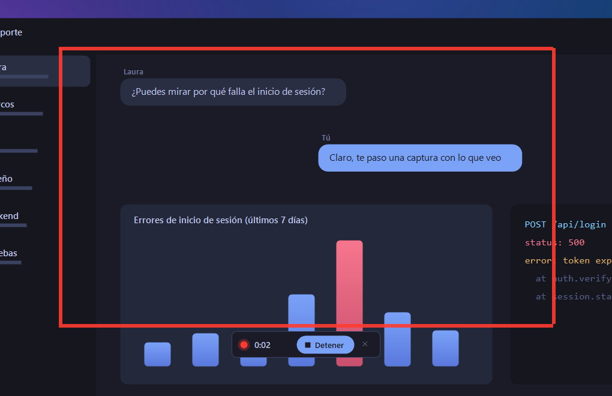

<div align="center">


# Stackshot

**Capturas de pantalla preciosas para Windows.**<br>
La experiencia de CleanShot X, por fin en Windows: miniaturas flotantes, editor rápido, vídeo y GIF. Gratis y libre.

[](https://github.com/rubenitx/stackshot/releases/latest/download/Stackshot.exe)

[](LICENSE)


[](https://github.com/rubenitx/stackshot/actions/workflows/build.yml)

[English](README.en.md) · [Descargar](https://github.com/rubenitx/stackshot/releases/latest) · [Novedades](CHANGELOG.md)


</div>

Pulsa **Impr Pant**, elige un área (o haz clic en una ventana) y la captura se queda flotando en una esquina, lista para **arrastrarla** al chat, **pegarla** donde quieras o **marcarla** en un segundo. Las que no guardas se borran solas: tu escritorio no se llena de "Captura (37).png".

Inspirado en CleanShot X, hecho para Windows, ligero (un único `.exe` de menos de 1 MB) y sin nada que instalar aparte.

## Lo que hace

### Una pila de capturas que no estorba


- Cada captura aparece abajo a la izquierda, con una animación suave. Varias a la vez, una encima de otra.
- **Arrástrala** a Teams, Slack, el chat de la IA, Outlook o el Explorador: va pegada al cursor.
- **Pégala** con Ctrl+V: al pegarla, su miniatura dice "Pegada" y se retira sola.
- Al pasar el ratón, una barra discreta: copiar, editar, guardar y fijar en pantalla.
- **Desliza** a la izquierda para descartarla.
- ¿Muchas? Hasta 20; con la **rueda del ratón** te mueves entre ellas.
- Con **varias pantallas**, la pila sigue al ratón.
- No sale en tus capturas ni cuando compartes pantalla.

<br clear="right">

### Elegir qué capturar, al píxel


La pantalla se congela: arrastra un área con lupa y medidas, o **haz clic en una ventana** para capturarla entera (con sus esquinas redondeadas de Windows 11, sin fondo detrás). Las flechas del teclado mueven el cursor de píxel en píxel.

### Un editor que abre al instante


Haz clic en una miniatura y marca lo importante antes de mandarlo:

| | |
|---|---|
| **Flechas** afiladas que se pueden **curvar** | **Recuadros** y **elipses** |
| **Números** 1, 2, 3… para explicar pasos | **Texto** con fondo, legible sobre cualquier cosa |
| **Resaltar** como un rotulador | **Pixelar** correos, nombres o datos |
| **Recortar** sin perder nada (Ctrl+Z lo deshace) | 5 colores y 3 grosores |

Cualquier marca se puede **mover, estirar o borrar** después. **Enter** la copia y cierra el editor.

### Vídeo y GIF



**Mayús + Impr Pant** graba vídeo MP4; **Ctrl + Mayús + Impr Pant**, un GIF. Graba solo el área que elijas, con el cursor, nítido aunque uses Windows al 125 % o al 150 %.

La primera vez que grabas, Stackshot descarga [FFmpeg](https://ffmpeg.org) (libre y gratuito) desde GitHub y comprueba su firma SHA-256. Las capturas de imagen no lo necesitan.

<br clear="right">

## Instalar

1. **[Descarga Stackshot.exe](https://github.com/rubenitx/stackshot/releases/latest/download/Stackshot.exe)** y ábrelo.
2. Elige si quieres que arranque con Windows y en qué carpeta guardar tus capturas.
3. Pulsa **Instalar y empezar**. Ya está: pulsa **Impr Pant**.


- Se instala **solo para tu usuario**, sin permisos de administrador, en `%LOCALAPPDATA%\Programs\Stackshot`.
- Aparece en el menú Inicio y en **Configuración > Aplicaciones** (para desinstalarlo como cualquier otro programa).
- Funciona en **Windows 10 y 11** sin instalar nada más (.NET Framework 4.8 ya viene con Windows).

> **"Windows protegió su PC".** Stackshot todavía no está firmado digitalmente, así que la primera vez Windows SmartScreen avisa. Pulsa **Más información > Ejecutar de todas formas**. El código está aquí entero y cada versión se compila en GitHub Actions a partir de él.

**Para departamentos de sistemas**, instalación silenciosa:

```powershell
Stackshot.exe --install --startup --folder "D:\Capturas"   # --no-start para no abrirlo al terminar
Stackshot.exe --uninstall --quiet
```

## Atajos

| Atajo | Qué hace |
|---|---|
| **Impr Pant** | Capturar un área (o clic en una ventana o en el escritorio) |
| **Ctrl + Impr Pant** | Capturar la pantalla en la que está el ratón |
| **Alt + Impr Pant** | Capturar la ventana activa |
| **Mayús + Impr Pant** | Grabar vídeo (otra vez para parar) |
| **Ctrl + Mayús + Impr Pant** | Grabar GIF |

Se cambian en **Ajustes** (icono de la bandeja). Si Windows 11 tiene Impr Pant reservada para Recortes, Stackshot se ofrece a liberarla al instalarse.

## Privacidad

- **Nada sale de tu equipo.** Sin cuentas, sin nube, sin telemetría.
- La única conexión es la descarga opcional de FFmpeg la primera vez que grabas.
- Las capturas que no guardas viven en `%LOCALAPPDATA%\Stackshot\temp` y se borran solas una hora después (nunca mientras su miniatura siga en pantalla).

## Ligero de verdad

En reposo usa unos **40 MB de RAM y 0 % de CPU**: las animaciones solo gastan mientras algo se mueve y las miniaturas que no están a la vista sueltan su imagen.

## Compilar desde el código

No hace falta Visual Studio: basta el compilador de C# que trae Windows.

```powershell
git clone https://github.com/rubenitx/stackshot
cd stackshot
.\build.ps1          # bin\Stackshot.exe
.\build.ps1 -Run     # compila y lo abre sin instalar
```

| Carpeta | Qué hay |
|---|---|
| `src/` | El programa (C# 5, WinForms): la pila, el editor, la captura, la grabación y la instalación |
| `assets/` | Logo e icono (`tools\make-logo.ps1` los dibuja en código) |
| `docs/` | Imágenes de este README (`tools\make-screenshots.ps1` las regenera sobre un escritorio de mentira) |

## Preguntas

**¿Dónde se guardan las capturas?** Solo las que guardas (💾 en la miniatura o Ctrl+S en el editor), en la carpeta que elegiste al instalar (por defecto `Imágenes\Stackshot`). Se puede cambiar en Ajustes.

**Impr Pant no hace nada.** Otro programa la tiene ocupada (Recortes, ShareX, Lightshot, Greenshot…). Stackshot te avisa al arrancar; ciérralo o elige otro atajo en Ajustes.

**¿Y en el Mac?** Esto es para Windows. En macOS, CleanShot X es la referencia de la que bebe Stackshot.

## Contribuir

Las ideas, los fallos y las mejoras son bienvenidos en [Issues](https://github.com/rubenitx/stackshot/issues). Si quieres programar, `build.ps1` compila en segundos y el código está comentado en castellano.

## Licencia

[MIT](LICENSE) © 2026 Rubén Martínez. Úsalo, cámbialo y compártelo.

FFmpeg no se incluye: se descarga aparte, con su propia licencia (GPL), solo si grabas vídeo o GIF.
